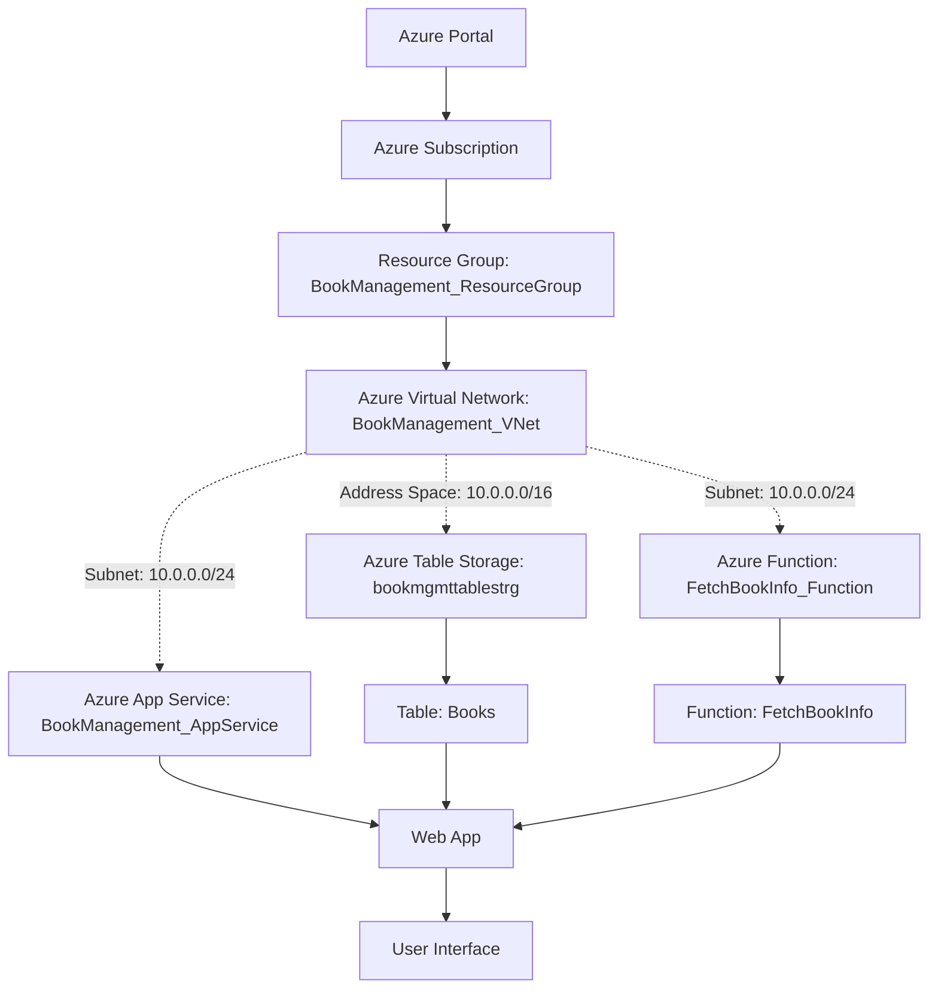

## Azureで書籍管理システム

- クラウド上でのシステム開発は初めてで、大昔にLAMP環境で開発を１～２個やったことがある程度です。

### 構成イメージ

- 今回は構成イメージとインフラ部分のデプロイまで

```mermaid
graph TD
    A[Azure Portal] --> B[Azure Subscription]
    B --> C[Resource Group: BookManagement_ResourceGroup]
    C --> D[Azure Virtual Network: BookManagement_VNet]
    D -. "Address Space: 10.0.0.0/16" .-> E[Azure Table Storage: bookmgmttablestrg]
    D -. "Subnet: 10.0.0.0/24" .-> F[Azure App Service: BookManagement_AppService]
    D -. "Subnet: 10.0.0.0/24" .-> G[Azure Function: FetchBookInfo_Function]
    E --> H[Table: Books]
    F --> I[Web App]
    G --> J[Function: FetchBookInfo]
    H --> I
    J --> I
    I --> K[User Interface]
```

